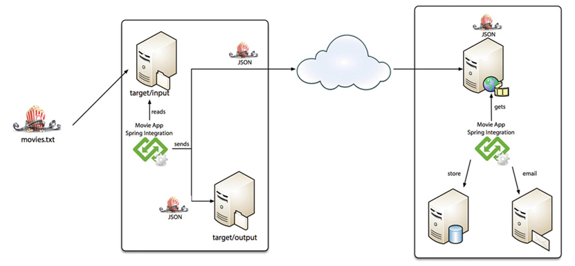

# Spring Boot Integration.
This example is taken from book [Spring Cloud Data Flow.](https://www.amazon.com/Spring-Cloud-Data-Flow-Orchestration/dp/1484212401)
I added a few things more instead.

## Environment
* Java 15 or latest available
* Maven
* Spring boot 2.7.9

## Requirements:
Imagine that you get some information about new movies (title, actor, year) in a text file (CSV format), 
and you need to send this information to an external and remote system that only accepts a JSON format. 
This remote system has a REST API service that takes your collection (/v1/movies). 
After receiving the information, it saves it to a database (MySQL) and sends an email to the admin user.

## Design:
 

## Example File:
The sample file can be found in ``asset`` directory. copy to ``target/input`` 
directory. If not exist you can create.

## Configuration Channel:
The configuration channel xml file can be found in ``resources/META-INF/xxx-app-integration.xml``

## Running the integration:
````shell
cd movi.web
./mvnw spring-boot:run
````
then
````shell
cd movi-proccesor
./mvnw spring-boot:run
````
